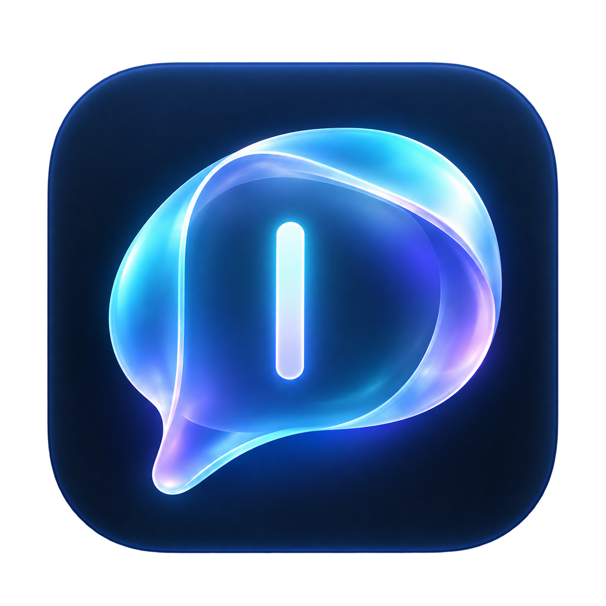
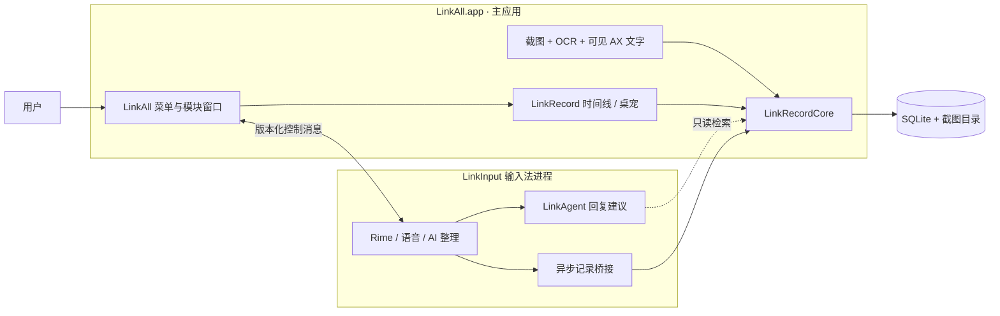

<div align="center">


# LinkAll

**造一个“另一个我”。**

一个理解你正在做什么、记得你的工作背景与判断方式，并最终能在约定范围内替你接手工作的个人 Agent。

*Building “another me” — a personal agent that sees how you work, remembers why you decided, and eventually takes work off your hands.*


</div>

## 愿景：另一个我

今天的 AI 助手每次都从零开始：你要一遍遍解释背景、贴上下文、说明自己的偏好，它才勉强跟上。真正有用的个人 Agent 应该反过来——**它本来就在场**。它知道你刚才在和谁讨论什么、上周为什么否掉了那个方案、你回消息时习惯怎么措辞、哪些事你愿意交给它、哪些必须你亲自拍板。

LinkAll 想走到那一步：

1. **看见**：完整、可追溯地记下你在电脑上的表达与工作现场——你打的字、说的话、看过的屏幕、用过的应用。
2. **理解**：从你对建议的采用、修改和纠正中，逐步学到你的判断方式，而不只是模仿你的语气。
3. **接手**：关联你授权的编程会话、文档资料和浏览活动，重建工作上下文与决策过程；先替你起草，再在预先约定的范围内代你回复、处理事务、执行明确授权的动作。

最终，它应该能在你划定的边界内**代表你作出日常决策、完成事务**——成为一个真正能接手工作的“另一个我”。

### 为什么从输入法开始

想理解一个人，最可靠的材料是他亲口说的话和亲手写下的字，而不是事后对屏幕的猜测。所以 LinkAll 从最底层的入口切入：**输入法**。

你在任何应用里打的每一个字、说的每一句话，都经过 LinkInput；它们是最直接、最准确的“我”的数据源。在此之上，LinkRecord 补齐你当时看见的屏幕和所处的应用，LinkAgent 再基于这些证据去理解和行动。

```text
   LinkInput            LinkRecord              LinkAgent
  你说了什么    →    你看见了什么、在做什么   →   理解你，然后替你做
 （表达的源头）        （可回看的工作证据）         （从建议到授权执行）
```

### 演进路线

“另一个我”不会一步到位。每往前走一步，都要先证明上一步真的有用：

| 阶段 | 它做什么 | 用什么来验证 | 状态 |
| --- | --- | --- | --- |
| **0 · 记录** | 可靠地记下输入、语音、屏幕与活动，能检索、回看 | 想找的东西找得回来 | ✅ 已实现，持续提升质量 |
| **1 · 回顾与检索** | 根据问题找回相关记录，并给出处 | 少解释背景，来源准确 | 🟡 部分实现（当前场景检索） |
| **2 · 建议与草稿** | 围绕当前任务给出回复和草稿 | 你需要改的越来越少，立场与承诺更准确 | 🟡 已有三候选回复建议 |
| **3 · 影子运行** | 预测你会怎么处理，事后与你的实际做法对照，不自行发送 | 它是否理解你的取舍，而不只是模仿语气 | ⚪ 规划中 |
| **4 · 有限代理** | 在预先约定的对象、场景和动作范围内替你执行 | 完成率、误操作、可恢复与可审计 | ⚪ 规划中 |
| **5 · 更广泛代理** | 经过具体场景验证后逐步扩大授权 | 是否真正节省你的总时间，而不是增加维护负担 | ⚪ 远期 |

### 原则

越接近“替我做决定”，越要克制。LinkAll 从第一天起就按这些原则设计：

- **观察不等于理解。** 看过不等于认同，停留不等于读懂，一次妥协也不等于长期偏好。系统要把**事实**、**你明确说过的**和**它自己推断的**分开保存，推断附上依据与不确定性，并且允许你随时纠正、删除和标记例外。
- **记录权限与行动权限分离。** 能读到你的资料，不代表能替你发消息。屏幕上的文字、文档内容都不能直接指挥工具；发送、修改、删除、运行命令都需要明确的目标、范围和授权。
- **按场景授权，而不是步步打断。** 授权尽量按任务或场景一次给出，Agent 在范围内自主推进，只在越界、缺少关键信息或需要新的高影响授权时才来问你。
- **写入不等于发送。** 现阶段 LinkAll 从不合成回车、不自动提交消息或 shell 命令；AI 产出只是候选，由你决定是否采用。
- **本地优先，可控可删。** 历史只存在你的 Mac 上，不自动上传；记录可以暂停、排除和删除。
- **基础能力不依赖 AI。** 没有网络、没有配置模型时，打字和记录照常工作。

## 现在能做什么

愿景很远，但每一块都已经从能用的东西开始。LinkAll 目前由三个部分组成，从菜单栏的 **LA** 图标统一打开：

| 模块 | 做什么 |
| --- | --- |
|  **LinkInput** | 基于 Rime 的中英文输入法，加上语音输入和就地 AI 整理，是“我”的表达源头 |
|  **LinkRecord** | 本地记录输入、语音和可见屏幕文字，可搜索回看，附带可自定义的桌宠 |
|  **LinkAgent** | 根据当前输入框和同窗口近期记录，给出三条意图不同的候选回复 |

> [!NOTE]
> 这是作者自用的个人项目，目前只做过本机开发构建，没有公证，也没有面向其他机器的发布包。欢迎参考代码和设计；自行构建需要 Apple 开发者证书（见[从源码构建](#从源码构建)）。

## 特性详情

**LinkInput · 输入**

- 小鹤双拼、全拼、五笔 86 三种中文方案，以及英文补全 / 英文直通；中文方案可直接输入英文单词。词库使用雾凇拼音（rime-ice）。
- 语音输入：主动录音后调用你配置的语音识别服务，支持流式转写；可选择把转写交给文本模型整理成书面语，或保留原话。
- 就地 AI 整理：只处理显式选区，或无选区时当前小输入框（≤2000 字）的全文，不读取会话历史或文档全文。
- 语音整理、场景排版和 AI 整理的提示词都可在设置里按模式覆盖。
- 不覆盖你已有的输入法和用户词库。

**LinkRecord · 记录**

- 本地保存上屏文字、语音原始转写及整理版本、前台应用与窗口标题。
- 可选的屏幕记录：原生截图 + 系统 Vision OCR + 当前窗口可见的辅助功能文字，按画面指纹去重。
- 时间线检索、星标、备注；支持暂停、排除应用、逐条或按时间段删除。
- 截图默认按 30 天 / 100 GB 双上限清理，文字保留。
- 内置猫兔桌宠，可导入自定义形象，尺寸可调。

**LinkAgent · 回复建议**

- 在输入框中按 **V → 轻点左 Command**，基于当前草稿和同应用同窗口的近期记录，生成三条意图不同的候选回复，并附上引用的证据片段。
- 只读、无工具权限、不自动发送；选中候选只替换捕获的草稿。
- 终端（如 cmux、Claude Code）里可在确认同一编辑区域后，把候选插入光标处并保留已有文字。

## 隐私

> [!IMPORTANT]
> LinkRecord 会在本地保存大量个人数据（输入内容、转写、屏幕文字和截图）。请先阅读[隐私与数据流](docs/隐私与数据流.md)，再决定开启哪些记录。

- **本地优先**：历史存放在 `~/Library/Application Support/Yiliu/History/`（目录 0700，数据库 0600），不自动上传，也没有遥测。
- **云端处理需单独授权**：文本和音频上传各有独立开关，默认关闭。只有你主动触发语音、AI 整理或回复建议时才会请求 API。
- **回复建议的上传范围有限**：每次最多 10 条、12000 字的筛选文字，不上传图片、音频或整库记录。
- **密钥只存 Keychain**；诊断日志不含正文、音频或密钥；原始录音不落盘；锁屏即停止采集并清除临时草稿。
- 密码框和安全输入状态不采集，排除的应用不读取也不截图。

## 架构



- 输入法是独立进程，截图、OCR、检索和桌宠渲染都不会阻塞按键处理。
- 主应用拥有唯一的菜单栏入口；两个进程之间只传递封闭的操作枚举和状态，不传输入正文、截图、录音或密钥。
- LinkAgent 只依赖 LinkRecordCore，通过注入的函数复用已有的文本 API，自身不持有密钥。

分层、数据归属、安装兼容与回滚见[架构与升级说明](docs/LinkAll架构.md)。

## 从源码构建

**环境要求**

- macOS 14+、Apple Silicon
- Xcode（`swift test` 需要 XCTest，仅装 Command Line Tools 无法运行测试）
- Python 3（获取依赖、文档检查）
- Apple Development 签名证书。构建脚本默认匹配作者的 Team ID，请用环境变量换成你自己的：

```sh
export YILIU_TEAM_ID=<你的 Team ID>          # 或直接指定证书
export YILIU_SIGN_IDENTITY=<证书 SHA-1 或名称>
```

构建刻意不回退到 ad-hoc 签名：ad-hoc 签名每次重建都会让 Keychain 重新索要授权。

**构建与安装**

```sh
python3 scripts/bootstrap.py   # 首次：获取锁定版本的 librime 与 Rime 方案、词库
swift build
scripts/build.sh               # 构建并签名 LinkAll.app 与 LinkInput 输入法
scripts/install.sh             # 安装整套应用（会先备份当前版本）
```

安装位置：

| 应用 | 路径 |
| --- | --- |
| LinkAll | `~/Applications/LinkAll.app` |
| LinkInput 输入法 | `~/Library/Input Methods/Yiliu.app` |

`scripts/rollback.sh` 恢复上一版应用组合，`scripts/uninstall.sh` 卸载应用。这两个操作都不动历史、词库和凭据。

> [!TIP]
> 项目改过名，bundle id、输入源 ID 和数据目录仍沿用旧的 `work.yiliu.*` / `Yiliu`，这是为了让已有的系统授权、Keychain 凭据和历史继续有效。

## 使用

1. 打开 LinkAll，菜单栏出现 **LA**。
2. 在目标应用中选择 **LinkInput → 在当前应用使用 LinkInput**，启用输入源。首次使用需在系统设置里授予麦克风、辅助功能和录屏权限（按需）。
3. 按下方[配置 API](#配置-api)填入你自己的服务地址和密钥。不配置 API 时，打字和本地记录照常可用。
4. 常用操作：

| 操作 | 方式 |
| --- | --- |
| 打开模块、切换方案和模式 | 菜单栏 **LA** |
| 回复建议 | 在输入框按 **V**，再轻点**左 Command** |
| 选用候选（普通输入框） | `1` / `2` / `3`、↑↓ 后 Enter / Tab、鼠标；Esc 取消 |
| 选用候选（终端） | 仅鼠标点击 |

## 配置 API

LinkAll 不内置任何 API 服务，也不附带密钥。语音转写、AI 整理和回复建议都使用**你自己的**服务与 key，费用和数据条款由你和服务商之间决定。

在 **LinkInput 设置 → 模型与服务** 中填写：

| 项目 | 说明 |
| --- | --- |
| 文本 API 地址 | 必须是 HTTPS。支持 Gemini `generateContent` 与 OpenAI 兼容两种格式，可以直连官方，也可以填你自己的网关 |
| 语音 API 地址 | 语音转写服务地址，例如 ElevenLabs speech-to-text 或兼容网关 |
| 鉴权方式 | 在「高级连接设置」里选择：`Authorization`（自动加 `Bearer`）、`xi-api-key`、`api-key` 或 `x-internal-token` |
| API 凭据 | 两个服务共用一份，只保存在 macOS Keychain；URL 里不允许出现 `key`、`token` 之类的参数 |

填好后还需在 **通用与隐私 → 云端处理授权** 里分别勾选「允许文本云端处理」和「允许上传本次录音进行语音识别」，两项默认都是关闭的。

**自己构建时预置默认地址（可选）**：复制 `scripts/api-defaults.example.json` 为 `scripts/api-defaults.local.json` 并填入你的地址。这个文件已被 gitignore，`scripts/build.sh` 会把它打包进应用，新装时作为默认值，不会提交到仓库。密钥仍然只在设置里输入。

## 项目结构

```text
src/LinkAll/App/       主应用：菜单栏、模块窗口、输入服务连接与生命周期
src/LinkInput/App/     输入法：InputMethodKit、设置、草稿事务、录音、就地整理
src/LinkInput/Core/    输入选项、API 客户端、提示词、Rime 封装
src/LinkInput/Native/  librime C 桥
src/LinkRecord/Core/   记录模型、SQLite、保留策略
src/LinkRecord/UI/     记录界面、桌宠、截图与 OCR
src/LinkAgent/         回复建议：上下文筛选、提示词、三候选校验
src/Shared/            产品身份、控制协议、共用 UI 与品牌图标
scripts/               依赖获取、构建、安装、回滚与测试工具
tests/                 XCTest 单元测试
```

## 文档

| 文档 | 内容 |
| --- | --- |
| [架构与升级](docs/LinkAll架构.md) | 进程分层、源码依赖、数据归属、安装兼容与回滚 |
| [隐私与数据流](docs/隐私与数据流.md) | 每种操作读取、上传和保留什么，存储位置与删除方式 |
| [LinkAgent 回复建议](docs/Agent回复建议.md) | 上下文如何筛选、模型如何约束、已知局限 |
| [依赖与授权](docs/依赖与授权.md) | 锁定版本的第三方组件及其许可证 |

## 开发与验证

```sh
swift test                      # 草稿事务、隐私、输入引擎、记录与回复建议
python3 scripts/check-docs.py   # 文档链接与源码路径检查
```

单元测试不能替代实机验证：输入相关的改动需要在真实宿主应用里确认上屏行为。

## 当前边界与下一步

- 当前处在[演进路线](#演进路线)的第 0～2 阶段：LinkAgent 只有只读回复建议，影子运行、长期记忆和授权执行都还在规划中，未实现。
- 下一阶段优先继续打磨 LinkRecord：OCR 清晰度与版面还原、漏采与误采、检索结果的来源回溯，以及日常资源开销。
- 编程会话、浏览历史、文档资料等连接器的范围，个人记忆如何确认与失效，首个可代理的场景，都还有待确定。
- 记录不保存稳定的聊天 ID 或浏览器标签页 ID，同名窗口可能切换过会话；回复建议无法证明时会建议澄清。
- 终端里的当前草稿无法直接读取，回复建议主要依赖筛选后的记录。
- 只在作者的机器上验证过，未公证，未做多机发布验收。

## 致谢

输入引擎与方案来自 [Rime](https://rime.im/) 社区：[librime](https://github.com/rime/librime)、[rime-ice（雾凇拼音）](https://github.com/iDvel/rime-ice)、rime-double-pinyin、rime-pinyin-simp、rime-wubi、rime-prelude、rime-stroke。完整列表与许可证见[依赖与授权](docs/依赖与授权.md)。

## 许可证

本仓库代码采用 [MIT](LICENSE) 许可证。

构建时由 `scripts/bootstrap.py` 获取并打包进应用的第三方组件保留各自的许可证，例如 librime 为 BSD-3-Clause，部分 Rime 方案与词库为 GPL-3.0 / LGPL-3.0。分发构建产物时需同时遵守这些许可证，详见[依赖与授权](docs/依赖与授权.md)。
