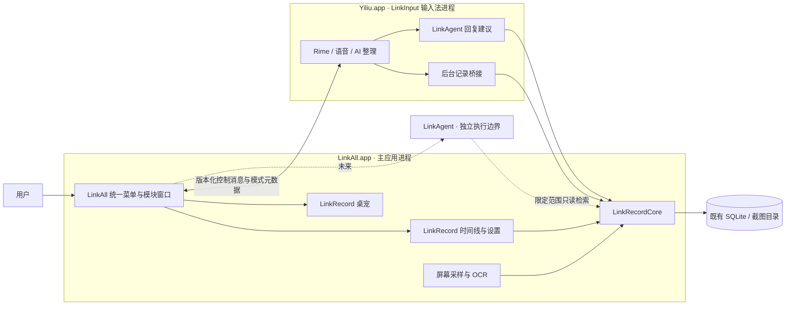

# LinkAll 架构与升级说明

2026-10-04。总产品与运行入口为 LinkAll，按职责拆分 LinkInput、LinkRecord、LinkAgent。LinkAgent 已接入只读回复建议，任务执行尚未实现。

## 分层与进程

输入法保持独立进程，使截图、OCR、检索及宠物渲染不阻塞按键处理。当前 LinkAll 主进程承载界面与 LinkRecord 后台任务；OCR 用后台任务并限制并发。无需为了模块名字额外创建第三个空进程。

LinkAgent 实现时应隔离任务/工具执行，不把权限较大的执行器嵌入输入法；由 LinkAll 管理入口、授权及生命周期。

## 源码与编译依赖

| 路径 | 职责 | Swift target |
| --- | --- | --- |
| `src/LinkAll/App/` | 唯一菜单栏、三模块主窗口、输入服务连接与生命周期 | `LinkInputCompanion`（历史内部名），产品 `LinkAll` |
| `src/LinkInput/App/` | InputMethodKit、设置、输入目标与草稿事务、录音/就地整理、后台记录桥接 | `Yiliu` |
| `src/LinkInput/Core/` | 输入选项、API 客户端、提示词、Rime 封装、草稿规则 | `YiliuCore` |
| `src/LinkInput/Native/` | librime C 桥 | `CRime` |
| `src/LinkRecord/Core/` | 记录模型、SQLite、保留策略、采样与生命周期规则 | `LinkRecordCore` |
| `src/LinkRecord/UI/` | 记录界面、桌宠、桌面采集与 OCR | `LinkRecordUI` |
| `src/Shared/` | 产品身份、模块枚举、元数据控制协议 | `LinkAllShared` |
| `src/Shared/UI/` | 共用侧栏、标题、间距、系统强调色与四个品牌图标 | `LinkAllUI` |
| `src/LinkAgent/` | 当前场景检索、证据筛选、三候选提示与输出验证 | `LinkAgent`，仅依赖 LinkRecordCore |

`LinkAllShared` 仅依赖 Foundation。`LinkAllUI` 使用 AppKit / SwiftUI，由主应用、输入设置和记录 UI 共用，不进入记录 Core 的依赖。LinkRecordCore 依赖 SQLite 与 Shared；LinkRecordUI 依赖 Core。LinkInput 引用 RecordCore 写记录，但不引用 RecordUI，因此不加载截图/OCR/桌宠实现。原 `Yiliu` / `YiliuCore` 技术名保留兼容，目录与产品概念使用新结构。

文本/语音网络客户端留在 YiliuCore。LinkAgent 通过注入的异步生成函数复用既有文本 API，不引用 YiliuCore/Rime，也不持有密钥。回复建议只读、没有工具权限，可在输入法进程中异步运行；将来的工具执行仍须独立进程。详见 [回复建议](Agent回复建议.md)。

## 图标与桌宠显示

- 当前图标采用用户选定的原版 B / AURORA（流光玻璃）。彩色原图在 `src/Shared/UI/BrandAssets/`，`src/Shared/UI/BrandIcon.swift` 统一外框尺寸并绘制对应单色轮廓；`scripts/icon.swift` 导出彩色 ICNS / PNG 与多分辨率单色 TIFF，构建产物在 `build/BrandIcons/`。两个应用包均携带 BrandAssets；SwiftPM 开发构建使用模块资源。
- LinkAll 状态项使用单色 LinkAll 图标；两个应用通过 `CFBundleIconFile` 使用各自彩色图标。LinkInput 的菜单、备用菜单和输入模式面板图标均指向 `LinkInputMenu.tiff`，输入法整体图标指向 `LinkInput.icns`。不改输入源 ID。
- `src/LinkRecord/UI/PetArt.swift` 绘制内置猫兔与互动表情，自定义图片共用桌宠交互层。导入使用独立文件路径刷新形象，设置保存后清理应用管理的上一张图片；切换内置形象保留已导入图片。
- `src/LinkRecord/Core/PetSizing.swift` 统一桌宠 80–360 pt 范围与默认 150 pt。设置页滑块使用持久化设置，调整后面板限制在所在屏幕可见范围内，互动效果随尺寸缩放。

## 交互与状态边界

- LinkAll 拥有唯一自建 `NSStatusItem`；输入法和 RecordUI 不再另建菜单栏入口。
- LinkAll 向 LinkInput 发送封闭的用户操作枚举：设置、在当前应用选用输入源、选方案/模式、开始或结束语音、手动整理。输入法返回方案/模式名称与当前状态。
- 控制协议带版本。未识别动作拒绝；不通过通知传输输入正文、截图、录音或密钥。
- 选用输入源、语音与整理命令携带触发时的目标 PID；冷启动等待后若目标已切换，不继续对新窗口执行。实际写入仍由原有 InputTarget/DraftSession 验证。
- 服务先注册通知再公布状态。主应用排队用户操作，收到状态后发送，超时或进程退出后显示连接问题；菜单的勾选以输入法公布的实际配置为准。
- LinkRecord 的设置及桌宠操作在主应用内部完成。隐藏宠物只影响界面，暂停才停止采集。
- 生命周期由 LinkAll 主应用管理。退出前先隐藏窗口、恢复外部应用焦点，再停止输入服务，避免 macOS 按应用记忆输入源导致主应用被重新拉起。输入法不再在后台启动时反向拉起 LinkAll；其系统菜单保留显式打开 LinkAll 的入口。若 macOS 后续因再次使用该输入源启动输入服务，不会顺带重开主应用。
- 当前分布式通知是同用户桌面进程之间的控制机制，不是未来 Agent 的执行授权边界。未来工具执行需校验对端身份的 IPC、动作授权与审计。

## 数据归属

| 数据 | 所属模块 | 规则 |
| --- | --- | --- |
| 输入方案、语音/整理模式、API 配置与凭据引用 | LinkInput | 既有 UserDefaults / Keychain 服务不改名 |
| 原始上屏、转写/整理版本、截图、OCR、应用窗口、星标备注 | LinkRecord | 本地 SQLite 与图片文件；诊断无正文 |
| 推断偏好、检索摘要、任务、执行记录 | LinkAgent（未来） | 另存并引用证据 ID，不覆写原始记录 |
| 模块选择、菜单与服务连接状态 | LinkAll | 不直接处理或改写用户输入 |

未来新增数据字段和记录类型需要明确版本、兼容默认值与迁移测试；应用回滚能否读取新数据必须另行验证。

截图去重使用可选的 `screenshotFingerprint`（`rgba8-srgb-v1` 全尺寸像素 SHA-256），旧记录缺失时按未建立指纹处理；新增 JSON 表达式索引，不重写旧记录。`screenshotOCRComplete` 标记成功识别，OCR 失败时图片仍可共用，但下次重新识别。`HistoryStore.saveScreenshot` 在事务内复用现存图片及 OCR，连续片段仅延长 `ended`，新访问保留独立记录。删除最后一个引用才移除共用文件；30 天/容量上限仍可清理有引用的原图，复用不刷新文件年龄，原图清理后不再命中缓存。后续重新采到同画面会生成新文件，不恢复旧记录的已过期图片。

屏幕文字新增可选 `screenText`（版本 1），旧记录无此字段仍可读。坐标统一为截图左上角原点的归一化矩形，AX 记录角色/树路径，OCR 记录置信度与横条像素指纹。`ScreenOCR` 无全局文字缓存，只从未删除且原图可读的记录按区域复用；`saveScreenshot` 在事务中再次验证复用来源，删除或过期则丢弃迟到结果。整图复用仅复用 OCR，当前 AX 结果不被旧访问覆盖。界面展示采用同位置 AX 优先，原始 OCR 块仍保留；这是几何排序，不是聊天语义重建。

回复检索不能直接使用截图的扁平 OCR：显示器截图会包含后方应用。`ScreenTextSnapshot.windowTextBounds` 是新增的可选前台窗口范围证明；新采样通过可见性验证后写入。Agent 只选该范围内的文字块；旧数据没有证明时仅选当时已校验的 AX 文字，不改写旧历史。

`VisibleAccessibility` 只在截图开关与录屏权限生效时运行，限制前台窗口范围、祖先裁剪区域、可见字符范围及节点/字符/时间预算。普通窗口遮挡直接拒绝；浮层交叠要求系统 AX 五点命中同一窗口，以兼容透明水印。系统 AX 不能证明所有自绘或不参与命中的像素遮挡，故其覆盖率与正确性仍需宿主对照；无法确认或接口不支持的内容依赖截图 OCR。浏览器扩展与 DOM 连接器未新增。

本次新增记录可由旧构建读取，但去重前版本的删除逻辑不识别共享图片引用；产生共享记录后，不应回滚到该版本执行历史删除。回滚写入兼容仍需单独迁移处理，不能仅凭可选字段可解码视为完整兼容。

新概念不强迫搬动旧存储。现有 `~/Library/Application Support/Yiliu/History` 与 Rime 目录继续使用，避免数据分叉或重复采集。

## 安装、兼容与回滚

| 对外名称 | 安装路径 | 保持的技术身份 |
| --- | --- | --- |
| LinkAll | `~/Applications/LinkAll.app` | bundle `work.yiliu.companion`；可执行文件 `LinkInputCompanion` |
| LinkInput | `~/Library/Input Methods/Yiliu.app` | bundle/钥匙串 `work.yiliu.inputmethod.Yiliu`；输入源 `work.yiliu.inputmethod.Yiliu.Hans`；可执行文件 `Yiliu` |

保留身份是为了继续匹配原系统授权、凭据和设置，不表示产品仍叫旧名字。旧 `~/Applications/LinkInputCompanion.app` 在安装时验证归属、备份并移除，避免留下两个同 bundle 的运行入口。构建目录也不再保留旧嵌套伴侣。

`scripts/build.sh` 生成两个签名 app；`scripts/install.sh` 一次安装整套产品。安装前校验目标 bundle，停止两进程并备份到 `scratch/LinkAll-previous.zip`，不移动用户数据库。回滚恢复对应的整套应用组合，含改名前的旧组合；不回退用户记录和配置。卸载移除两个产品 app，保留历史、词库和凭据。

本文件的未来 Agent 边界是设计约束，不是已经交付的执行能力。
